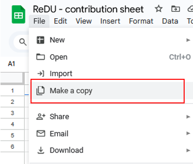
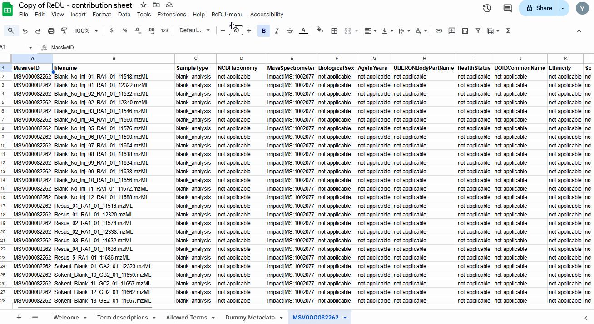
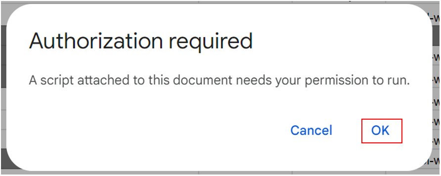
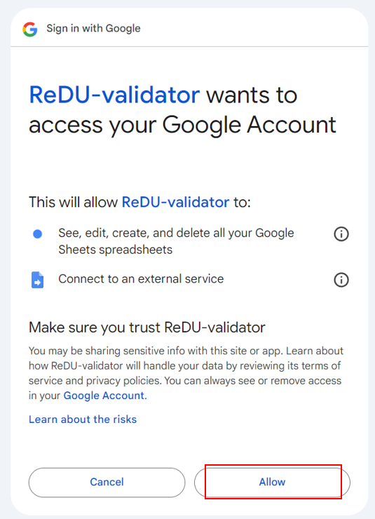
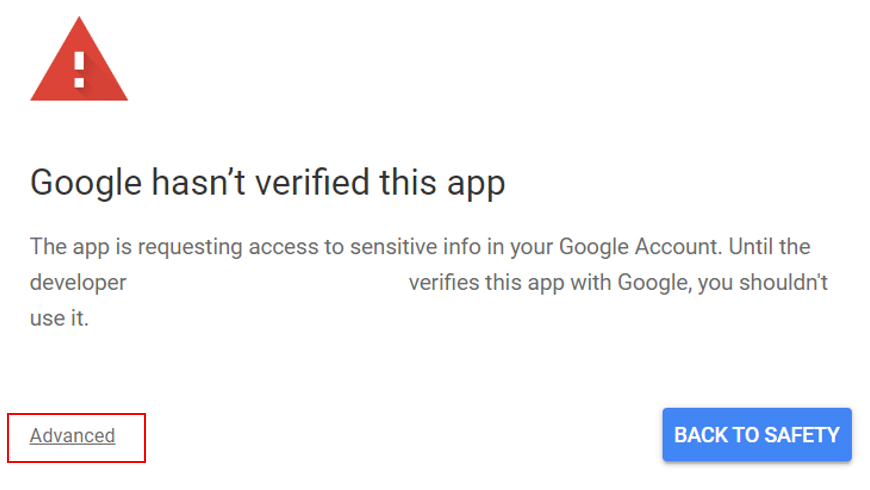
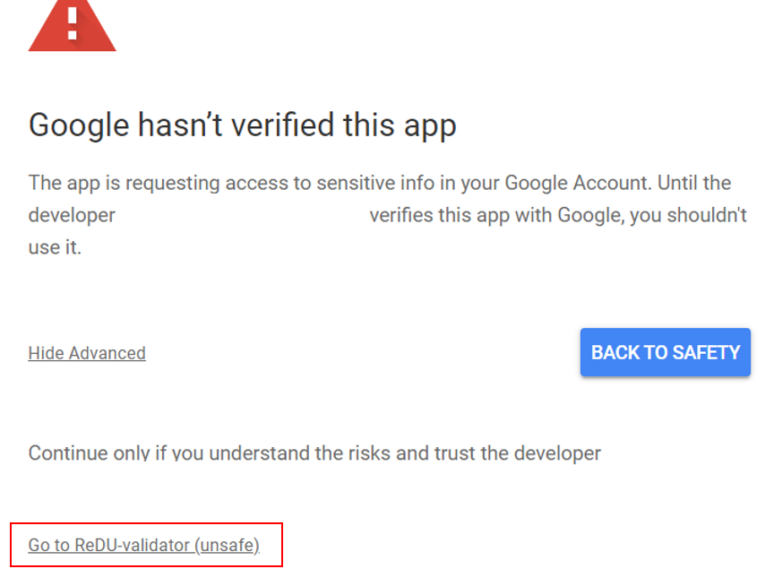
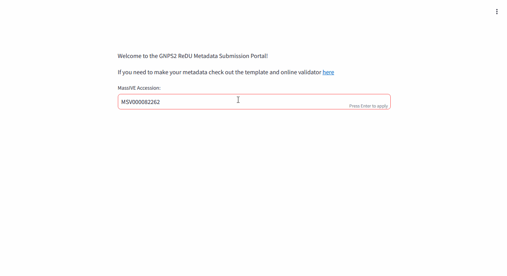

# Pan-ReDU metadata validation and submission

This tutorial explains how to submit metadata for your MassIVE dataset. This assumes that you have already submitted your mass spectral raw data at [MassIVE](https://massive.ucsd.edu/) (the tutorial for this step can be found [here]()). If you submitted your raw data to [MetaboLights](https://www.ebi.ac.uk/metabolights/index) or [Metabolomics Workbench](https://www.metabolomicsworkbench.org) we will automatically pull your raw data from there. In case you want to include a ReDU sheet for a dataset from there please reach out to us. 

## Steps to submit your metadata

1. **Create a metadata sheet**
    - You are allowed to use any of the Columns displayed in our [Term description sheet](https://docs.google.com/spreadsheets/d/10U0xnJUKa_mD0H_9suH1KJAlJD9io9e4chBX8EAHneE/edit?gid=1856413163#gid=1856413163). The filename and MassiveID columns are required. From the other columns you can select those relevant to your study. We hope that you provide as much information as possible! 
    - In ReDU we use a controlled vocabulary which means that you can only use certain terms in the table. Those terms are controlled either by us or externally as specified in the [Term description sheet](https://docs.google.com/spreadsheets/d/10U0xnJUKa_mD0H_9suH1KJAlJD9io9e4chBX8EAHneE/edit?gid=1856413163#gid=1856413163). The list of allowed terms controlled by us is displayed in the [Allowed terms sheet](https://docs.google.com/spreadsheets/d/10U0xnJUKa_mD0H_9suH1KJAlJD9io9e4chBX8EAHneE/edit?gid=155945972#gid=155945972). If you need more terms or columns please reach out to yelabiead(at)ucsd.edu.

2. **Validate your metadata sheet**
    - After you have created your sheet you should validate it to make sure everything went well. For this you will have to make a copy of our [Google Sheet](https://docs.google.com/spreadsheets/d/10U0xnJUKa_mD0H_9suH1KJAlJD9io9e4chBX8EAHneE/edit?usp=sharing). 

    

    - Copy your metadata into an empty sheet and click ReDU-menu --> Current Sheet Validation. This will validate you redu sheet and color cells depending on whether the values are accepted by Pan-ReDU or not. The first time you do this you will get a bunch of Warnings to click through as you have to trust our Sheet to use it. Below we have put some Screenshots so you understand what to click. You will only have to do this the first time you make a copy of our sheet.   

    

    How to click thorugh warnings (only first time script is run):

    

    

    

    

    - After the script ran through you will see a popup that tells you how many of your samples have (not) been accepted. If a cell is colored red it means that the respective row will not be accepted in ReDU. This will happen if your filenames dont have the expected extension (.mzML or .mzXML) or your MassiveID is not valid. Cells colored in grey will be replaced with "missing values" in ReDU. If a cell is colored in grey although you think it should be accepted check for spelling and capitalization mistakes, or white spaces (" ") at the end of your values. You can rerun the validation as often as you like.

    - Once you are happy you can download your table as a .tsv file. 

    - This tsv can now be submitted to ReDU through our [deposition portal](https://deposit.redu.gnps2.org/).

    

# Page Contributions
Yasin El Abiead (UCSD), and Mingxun Wang (UCR)