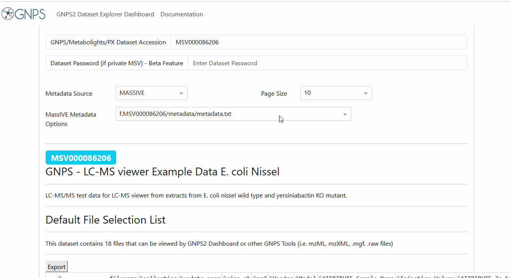

# Downloading public metabolomics data

This tutorial explains how to download public mass spectral raw data from [MetaboLights](https://www.ebi.ac.uk/metabolights/index), [Metabolomics Workbench](https://www.metabolomicsworkbench.org), or [MassIVE/GNPS](https://massive.ucsd.edu/) through GNPS tooling.

There are two main ways to download data.

1. Download raw data file-by-file in the [GNPS2 Dataset Explorer](https://explorer.gnps2.org/)

2. Download raw data in batch through our [public data downloader](https://github.com/Wang-Bioinformatics-Lab/downloadpublicdata), which requires just a few steps with some coding.

    a. Make sure you have [Python](https://wiki.python.org/moin/BeginnersGuide/Download) and [Git](https://github.com/git-guides/install-git) installed on your system.

    b. Clone the [repository](https://github.com/Wang-Bioinformatics-Lab/downloadpublicdata) by running 
    
       `git clone https://github.com/Wang-Bioinformatics-Lab/downloadpublicdata.git`.

    c. Navigate to the directory in your terminal with 
    
       `cd downloadpublicdata`.

    d. Install required packages with 
    
       `pip install -r requirements.txt`.

    e. Test if it works with 
    
       `python ./bin/download_public_data_usi.py ./data/test_download.tsv ./data/ ./data/summary.tsv`.

    f. Replace `./data/test_download.tsv` with the path to a TSV file containing the USIs you want to download. An example file can be found [here](https://github.com/Wang-Bioinformatics-Lab/downloadpublicdata/blob/main/data/test_download.tsv). If you want to select files based on metadata categories, we recommend downloading the Pan-ReDU table from the [Dashboard](https://redu.gnps2.org/selection/) and using the USI values from the table after filtering based on metadata. Files downloaded through the "USIs --> Raw Data Download" button on the [ReDU Dashboard](https://redu.gnps2.org/selection/) already have the correct format.

# Page Contributions
Yasin El Abiead (UCSD) and Mingxun Wang (UCR)
