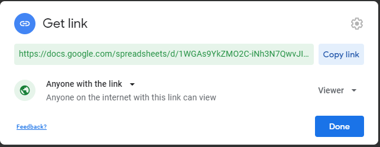

# Metadata

## Summary

The metadata file used in GNPS2 describes the properties of a file/sample (*e.g.* sample type, year of analysis, and collection method). Metadata adhering to the accepted formatting for each tool enhances data analysis and visualization options. We strongly encourage you to prepare metadata files in advance and [upload](https://mwang87.github.io/ReDU-MS2-Documentation/HowtoContribute/) to the supplementary file folder in the corresponding MassIVE dataset. However, we understand that all of this information might not be available, so it is a suggest starting point. 

## Metadata Formats

There are two metadata formats we accept for the majority of GNPS2 workflows:

1. tab separated tsv file
1. Google Sheets shared link

!!! note "Google Sheets Supported Workflows"
    * Classical Molecular Networking Release 22 or later
    * FBMN Release 23 or later

### ReDU Metadata

The recommended starting point for both of these metadata is  [ReDU Sample Information Template](https://docs.google.com/spreadsheets/d/1v71bnUd8fiXX51zuZIUAvYETWmpwFQj-M3mu4CNsHBU/edit?usp=sharing) (additional documentation can be found [here](https://mwang87.github.io/ReDU-MS2-Documentation/HowtoContribute/)). Users can add an unlimited amount of additional columns to the ReDU Sample Information Template. To add additional columns that are recognized by GNPS2 workflows, you can prefix the column header with ATTRIBUTE_ (e.g. ATTRIBUTE_Organism). There are specific instructions on required columns and formatting detailed for GNPS2 tools below.

!!! note
    This standard metadata format works for the following GNPS2 tools
    
    1. Classical Molecular Networking
    1. Feature Based Molecular Networking
    1. GC Molecular Networking
    1. Qemistree

Metadata file used must be a tab-delimited text file. A .tsv can be downloaded from the ReDU Sample Information Template. Users that create a metadata file without using the ReDU Sample Information Template using a text editor (e.g. Microsoft Excel, Notepad++ for Windows, gedit for Linux, TextWrangler for Mac OS) should save as a .txt (tab-delimited). 

!!! warning
    Excel (xlsx), rich text (rtf) are not supported.

### Barebones Metadata

Starting from scratch, you can simply list the filenames for your mass spectrometry files and extra columns describing each file. 

Here is an example file without the ReDU Sample Information template in [Google Sheets](https://docs.google.com/spreadsheets/d/1pSrqOdmMVBhVGpxIZeglToxihymTuaR4_sqTbLBlgOA/edit?usp=sharing) and as a tsv download if you [Right-click, and Save link as](https://raw.githubusercontent.com/DorresteinLaboratory/GNPS2-Trinity/master/GNPS-Trinity_template_files/metadata_GNPS2_AMG_demo.txt) to download. A text editor can be used to edit it as desired. 

!!! info "Formatting metadata"
    The only required columns in the metadata is **"filename"** and the file names should match those uploaded to GNPS2 and selected for analysis. 		**Capitalization matters.**

!!! info "Formatting metadata"
    To add additional columns that are recognized by GNPS2 workflows, you can prefix the column header with ATTRIBUTE_ (e.g. ATTRIBUTE_Organism). Columns without the ATTRIBUTE_ prefix will be ignored. 

### Google Sheets Metadata

Using metadata in Google Sheets is a relatively new feature and we warn there might be some bumps in the road. You can find the a barebones example [here](https://docs.google.com/spreadsheets/d/1WGAs9YkZMO2C-iNh3N7QwvJI21Ogz9Zb8dNj8-eQRqg/edit?ouid=112039669197743156595&usp=sheets_home&ths=true). 

In order to use Google Sheets as your source of metadata you will need to accomplish the following steps. 

???+ info "Make sure you metadata is the first sheet of your Google Sheets"
    
    
???+ info "Share metadata so that others can view simply by having the link"
    
    

???+ info "Paste Link into Metadata Field in GNPS2"
    

## Requirements Specific to Molecular Networking

The use of a metadata file is an alternative way to assign groups when selecting data input files within the workflow of GNPS2. The current version of molecular networking allows to use the metadata table as an input. 

!!! tip
    Indicate which metadata columns should be considered in analysis by opening the file in a text editor and adding             "ATTRIBUTE_" to the header of the column.
* Save the file (must be tab-delimited text file)
* Users must upload their data file
* Users must select the metadata file and place it in the **"Metadata File"** folder

## Page Contributions