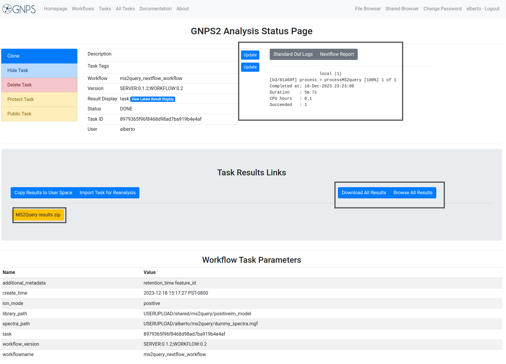

# MS2Query workflow documentation

MS2Query is a tool published by N. De Jonge in the Integrated Omics for Metabolomics and Genomics Annotation lab to find the best match in libraries using MS/MS spectra. It uses MS2DeepScore to calculate the similarity between 
the query spectrum and all library spectra for a subsequent rank of the top matches using a Random Forest Model. 

## Quick tutorial of MS2Query workflow

### Input

| Parameter  | Description        |  Default | Required | 
| ------------- |-------------| -----| -----|
| Job Description | Label for the MS2Query job to identify it by the user. | | no |
| Spectra files | Provide a file with ms/ms spectra. Allowed formats are mzML, json, mgf, msp, mzxml or usi. Those files should have been uploaded to GNPS2 See [file upload documentation](fileupload.md). | | yes |
| Ionization mode | Mass spectrometry acquisition mode. | Positive | yes |
| Library models | MS2Query uses a Random Forest Model to rank the highest scores in similarity spectra. This The users can use their own models. If the user chooses negative ionization mode, change the model to shared/ms2query/negativeim_model. To train your own models, check the [github documentation](https://github.com/iomega/ms2query/tree/main). | positiveim_model | yes | 
| Additional metadata columns from the experimental data | The columns will be added to the output file with their corresponding values. The name should match the name on the spectra file. It is case sensitive. | retention_time feature_id | no |

The fields are presented in the image. Bold fields are mandatory:

### Example Input

| #   | Information                                        | Value                                      |
| --- | ------------------------------------------------- | ------------------------------------------- |
| 1.  | Task description                                  | User label to identify the workflow task    |
| 2.  | **Spectra Files**                               | USERUPLOAD/alberto/ms2query/dummy_spectra.mgf |
| 3.  | **Ionization mode**                               | Positive                                    |
| 4.  | **Library models**                                | USERUPLOAD/shared/ms2query/positiveim_model |
| 5.  | **Additional metadata columns**                   | retention_time feature_id                   |

### Output

| #   | Item                              | Description                                                                                                                      |
| --- | ----------------------------------| ---------------------------------------------------------------------------------------------------------------------------------|
| 1.  | **Log Text area**                 | Text area with the result of the task. If there is some failure, the log will be written there. If the task failed and you want to contact the support team, please provide the output of this text area along with the job id. |
| 2.  | **Full results from the job**     | Full results from the job. It can provide information to debug or to users with programming knowledge.                          |
| 3.  | **MS2Query results.zip**    | Zip file containing the csv file with the annotations. |

The different parts of the output are presented in the image:

## Example task

To test the functionality of the MS2Query workflow an [Example task](https://gnps2.org/status?task=8979365f96f8468d98ad7ba919b4e4af) can be visited, and this work can be reproduced by clicking the [clone button](./img/workflows/clone_button.png): 

### Example output

The result of the task is the annotation of features present in the MS/MS spectra file. MS2Query assigns a identifier for each spectra annotated, their corresnponding ms2query_model_prediction_score, the delta m/z of the precursor mass, the representation of the structure (InChI Key and SMILES, the metadata columns added by the user and the corresponding class )

 

# Full tutorial of MS2Query

TODO Niek 

## Citation

[Niek F. de Jonge, Joris J. R. Louwen, Elena Chekmeneva, Stephane Camuzeaux, Femke J. Vermeir, Robert S. Jansen, Florian Huber, Justin J. J. van der Hooft. MS2Query: reliable and scalable MS2 mass spectra-based analogue search. Nature Communications 2023, 14: 1752](https://doi.org/10.1038/s41467-023-37446-4)

## Page Contributors

{{ git_page_authors }}

