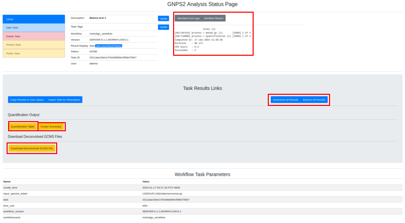
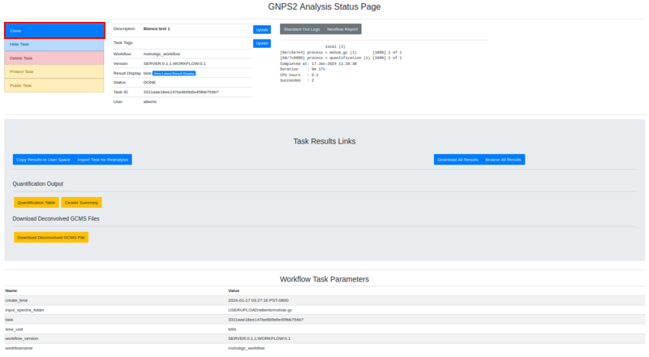
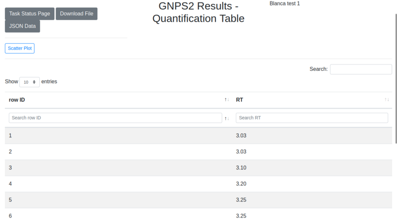
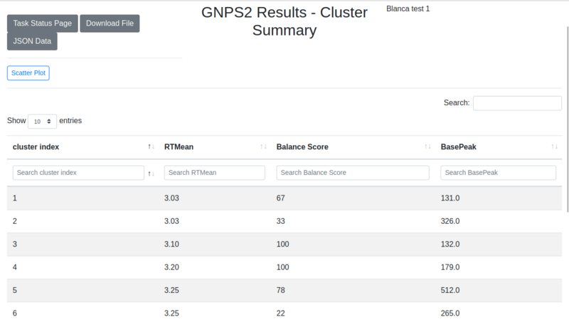

# mshub Workflow Documentation
Mshub is a workflow designed for the systematic processing of raw Gas Chromatography-Mass Spectrometry data. The tool consists in a Wide Spectral Alignment and a subsequent deconvolution, enhancing compound identification accuracy.

## Brief tutorial
### Input

 | Parameter | Description | Default | Required |
 | :-------- | :---------- | :------- | :--------- |
 | Input Spectra Folder | Folder with mass-spectrometry data. The files should have previously been uploaded to GNPS2  | | yes |
 | Time unit | Unit associated with the spectrum or chromatogram | sec | yes |

The inputs are represented in the image:

### Example input

|  | Information | Value |
| :----- | :----- | :------ |
| 1. | **Job description** | Name given by user to identify task |
| 2. | **File Selection** | USERUPLOAD/alberto/mshub-gc |
| 3. | **Time unit** | MIN |

### Output 

|  | Item | Description |
| :--- | :--- | :--- |
| 1. | **Log Text area** | Text area with the result of the task. If there is some failure, the log will be written there. If the task failed and you want to contact the support team, please provide the output of this text area along with the job id. |
| 2. | **Full results from the job** | Full results from the job. It can provide information to debug or to users with programming knowledge. |
| 3. | **Quantification table** | Table containing the quantitative information of each compound. Shows ID and retention time (RT). |
| 4. | **Cluster summary** | Table containing information about clusters in the analysis. Shows cluster index, mean retention time (RTMean), balance score and base peak. |
| 5. | **Deconvolved GCMS file** | Resulting data from a deconvolution process of the original data. |

The different outputs are represented in the following image: 

## Example task
### Example outputs

To test the functionality of the mshub workflow an [example task](http://ucr-lemon.duckdns.org:4000/status?task=3311aae18ee147be8b5b6e45fbb754b7) can be visited, and can be reproduced by clicking the [clone button](./img/workflows/mshub/outputClone.png):

### Example output
The resulting data from the wide spectral alignment and deconvolution is depicted in two tables and the deconvoluted data.
When looking at the quantification table, the row ID identifies the different compounds and RT shows the retention time associated to each of them. Results are sorted according to the row ID and RT.

The cluster summary shows a cluster index, identifying each cluster, a mean retention time showing the average retention time in that cluster, a base score for each cluster and a base peak, indicating the highest intensity peak within the cluster. Results are sorted by cluster index and RTMean.

